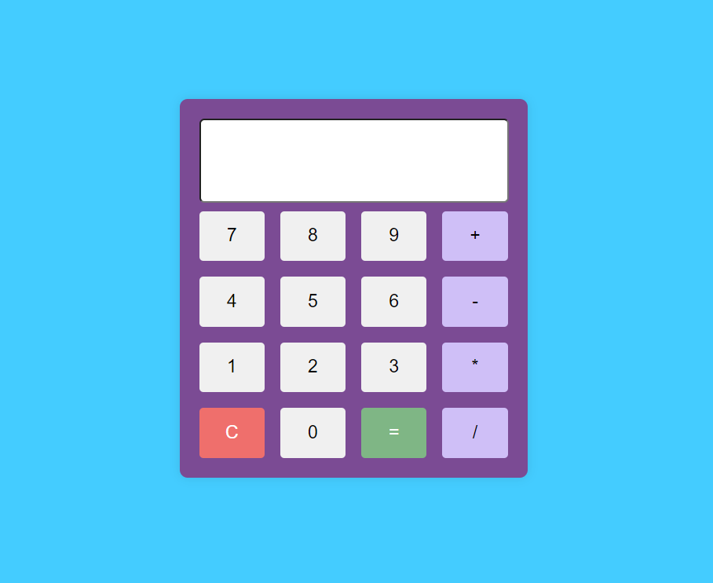

# React Redux Calculator

This project is a simple calculator application built using React and Redux.

## Table of Contents

- [Features](#features)
- [View Design](#getting-started)
  - [Prerequisites](#prerequisites)
  - [Installation](#installation)
- [Usage](#usage)
- [Technologies Used](#technologies-used)


## Features

- Basic arithmetic operations: addition, subtraction, multiplication, division.
- Responsive design for various screen sizes.
- State management using Redux for a consistent user experience.

## View Design


### Prerequisites

Before you begin, ensure you have the following installed:

- Node.js: [Download and Install Node.js](https://nodejs.org/)
- npm (Node Package Manager): This comes with Node.js installation.

### Installation

1. Clone the repository:

```bash
git clone https://github.com/your-username/react-redux-calculator.git
```

2. Navigate to the project directory:
```
cd react-redux-calculator
```

3. Install dependencies:
```
npm install
```

## Usage
To start the development server and launch the calculator application, run the following command:
```
npm start
```

Open your web browser and navigate to http://localhost:3000 to use the calculator.

## Technologies Used
* React: A JavaScript library for building user interfaces.
* Redux: A predictable state container for managing application state.
* React-Redux: Official Redux bindings for React.
* HTML5 and CSS3: Markup and styling of the application.
